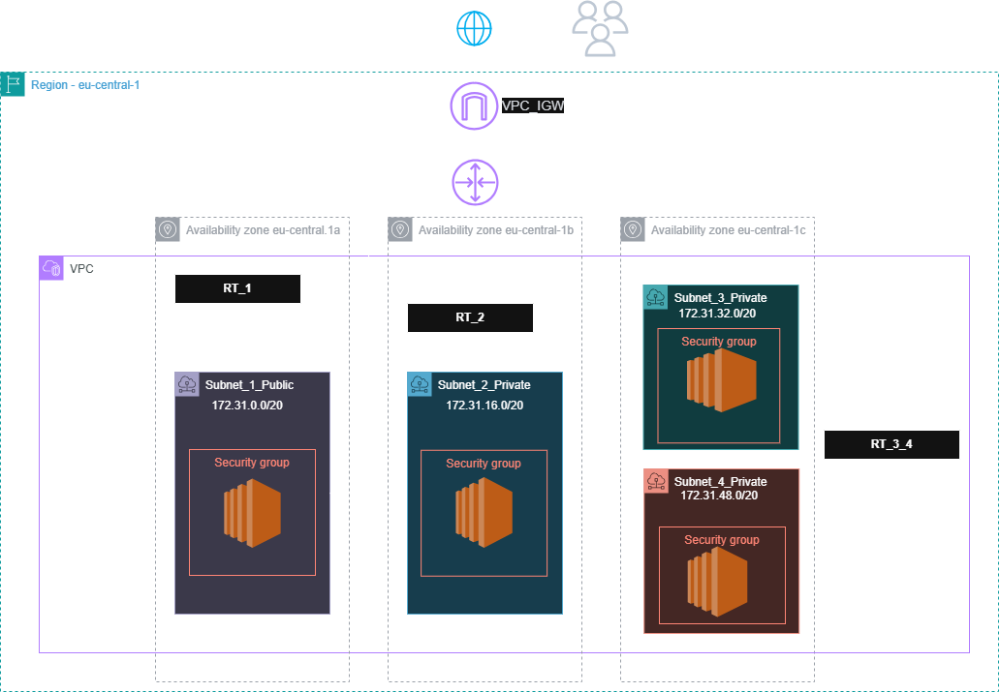

# AWS VPC in eu-central-1 (Frankfurt) – Subnets, IGW, AZs

Dieses Projekt zeigt eine saubere Basis-Netzwerkstruktur in AWS: **VPC** mit **Public/Private Subnets** über **zwei Availability Zones** in **eu-central-1 (Frankfurt)**, inkl. **Internet Gateway** und Routing.

## 🧱 Architektur

## 🎯 Ziel
- Aufbau einer VPC-Grundstruktur, wie sie oft als Startpunkt für Web/Serverless/EC2-Workloads genutzt wird
- Trennung von **öffentlich** (Public Subnets) und **privat** (Private Subnets)
- Hohe Verfügbarkeit durch **3 AZs** in eu-central-1

## 🌍 Region & Availability Zones
- Region: **eu-central-1 (Frankfurt)**
- Availability Zones: **eu-central-1a** , **eu-central-1b** , **eu-central-1c**

## 🧩 Komponenten
- **VPC**
- **1× Public Subnet** (je AZ)
- **2× Private Subnet** (je AZ)
- **Internet Gateway (IGW)**
- **Route Tables** für Public/Private Subnets

## 📐 Beispiel-IP-Plan (anpassbar)
- VPC CIDR: `172.31.0.0/16`

**Public Subnets**
- Public Subnet 1 (eu-central-1a): `172.31.0.0/20`

**Private Subnets**
- Public Subnet 2 (eu-central-1b): `172.31.16.0/20`
- Public Subnet 3 (eu-central-1c): `172.31.32.0/20`
- Public Subnet 4 (eu-central-1c): `172.31.48.0/20`

## 🛣️ Routing
### Public Route Table
- `0.0.0.0/0` → **Internet Gateway**
- Assoziiert mit: **Public Subnet_1_Public**

### Private Route Table
- Ohne NAT: **kein** `0.0.0.0/0` ins Internet (rein privat)
- Mit NAT (optional): `0.0.0.0/0` → **NAT Gateway** (im Public Subnet)
- Assoziiert mit: **Private Subnet 2 + 3 + 4**

## 🔐 Security Group

Die Security Group erlaubt einen sicheren Zugriff auf die EC2-Instance über das Internet.

### Inbound (eingehender Traffic)
- **SSH (Port 22)**
  - Protokoll: TCP
  - Port: 22
  - Quelle: **Eigene IP-Adresse**
  - Zweck: Administrativer Zugriff auf die EC2-Instance

### Outbound (ausgehender Traffic)
- **Alle Ports / Alle Protokolle**
  - Ziel: `0.0.0.0/0`
  - Zweck: Ausgehende Verbindungen (Updates, AWS Services)

### Best Practice
- Kein vollständiger Ingress-Zugriff (`All traffic`) aus dem Internet
- Zugriff nach dem **Least-Privilege-Prinzip**
- SSH ist auf eine vertrauenswürdige IP-Adresse beschränkt

## ✅ Ergebnis-Checks
- In Public Subnets können Ressourcen (z. B. EC2) mit Public IP ins Internet (über IGW)
- Private Subnets sind vom Internet getrennt (oder optional nur outbound über NAT)
- Subnets sind über mindestens 2 AZs verteilt → bessere Verfügbarkeit
